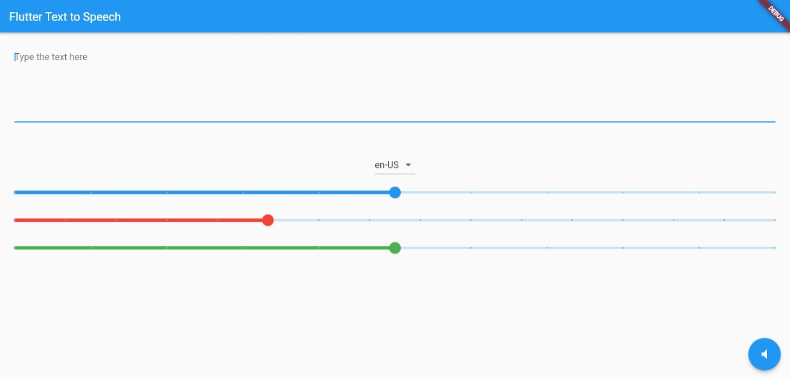

# Flutter Project - Text To Speech
    

Let's build a Text To Speech Flutter app which recognizes & analyzes your words to execute commands.

- [Social Media](#social-media)
- [Preview](#preview)

### ⚡&ensp;Social Media

&ensp;LinkedIn: [@MunirMohammed](https://www.linkedin.com/in/munir-mohammed-26015220b/ "LinkedIn Munir Mohammed")

&ensp;GitHub: [@Munirmohammed](https://github.com/Munirmohammed "GitHub Munir Mohammed")

### ✌&ensp;Preview

|                                App Preview                               |  
| :----------------------------------: | 
|  

